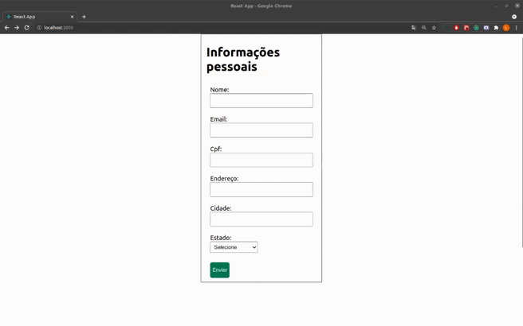

# Boas vindas ao exercício Formulário com Redux

## Vamos criar formulários utilizando `Redux`! 🚀

---

## Orientações

<details>
  <summary><strong>‼️ Antes de começar a desenvolver</strong></summary><br/>

- Crie um fork desse projeto, para isso siga esse [tutorial de como realizar um fork](https://guides.github.com/activities/forking/).
- Após fazer o fork, clone o repositório criado para o seu computador.
- Rode o comando `npm install`.
- Vá para a branch `main` do seu projeto e execute o comando `git branch` ou `git branch -a`.
- O exercício deverá ser feito na branch `main`.

</details>

<details>
  <summary><strong>🤝 Depois de terminar o desenvolvimento</strong></summary><br/>

Após a solução dos exercícios, abra um PR no seu repositório forkado e, se quiser, mergeie para a `main`. Sinta-se à vontade!

**Atenção!**: Ao criar o PR, você irá se deparar com essa tela:


É necessário realizar uma mudança. Para isso, clique no _base repository_ como na imagem abaixo:


Mude para o seu repositório. Seu nome estará na frente do nome dele, por exemplo: `antonio/TicTacToe`. Depois desse passo a página deve ficar assim:


Agora, basta criar o PULL REQUEST clicando no botão `Create Pull Request`.

> 💡 Realize esse processo para cada PR que abrir.

</details>

---

## Começando o exercício

É muito comum, na web, formulários com várias "etapas" (são também chamados de _multi-step forms_). Neste exercício, será necessário implementar o Redux para dois formulários encadeados:

- um para dados pessoais
- outro para dados profissionais;

Após o preenchimento dos dois formulários, as informações serão renderizadas na tela.

Os formulários já estão criados, com isso não é necessário criar novos arquivos, além dos propostos para a execução do exercício.



Para começar, é preciso salvar as informações de cada formulário no gerenciador de estados. Depois, em uma outra página, acessar esses dados para que sejam renderizados.

Por isso, você precisará de um gerenciador de estados (Redux), para salvar essas informações na `store` e também para acessá-las.

Mãos ao código! 💪

## 01 - Implementando as rotas e estrutura das páginas

Nesta aplicação, existirão quatro rotas. Uma página _Home_, duas páginas de formulário e uma tela de resumo das informações. Abaixo um pouco mais de detalhes de cada uma das rotas que deverá ser configurada.

- `/` - Raiz. Aqui deverá ser renderizado apenas um botão "Preencher Formulário"; Esta página está criada no componente `pages/Home.jsx`
- `personal-form` O primeiro formulário deverá aparecer nesta rota. Esta página está criada no componente `pages/PersonalForm.jsx`
- `professional-form` O segundo formulário deverá aparecer nesta rota. Esta página está criada no componente `pages/ProfessionalForm.jsx`
- `form-display` Nesta rota, deverá aparecer o resumo de todas as informações preenchidas nos dois formulários anteriores. Esta página está criada no componente `pages/FormDisplay.jsx`

Neste requisito, você deverá criar a navegação entre essas páginas, isto é, quando cada um dos botões forem clicados, a pessoa usuária deverá ser redirecionada para as rotas corretas.

A ordem das páginas deverá obedecer: `/` -> `personal-form` -> `professional-form` -> `form-display`.

## 02 - Implementando o Redux

Crie a estrutura de pastas e arquivos necessários para a implementação do Redux.

<details>
  <summary>
    Estrutura de pastas e arquivos:
  </summary>

- Crie a pasta `src/redux` para agrupar todos os arquivos relacionados ao Redux;
- Crie a pasta `src/redux/actions/` para armazenar as `actions` do projeto;
- Crie a pasta `src/redux/reducers` para armazenar os `reducers` do projeto;
- Crie o arquivo `src/redux/index.js`, que será o arquivo responsável por criar e exportar a `store` da aplicação.
- Implemente o `reducer`.
- Implemente a `store`.
- Implemente as `actions`.

</details>

👀 **De olho nas dicas:**

- De início, você pode implementar seu reducer apenas com o valor `default`;
- O `composeWithDevTools` pode te ajudar a visualizar as etapas do **_Redux_**;
- Lembre-se que, ao montar a estrutura do Redux, é preciso importar o `Provider`, que recebe a `store`, no `index.js`;
- Caso tenha dificuldade para montar a estrutura do Redux, você pode consultar o **Checklist do Redux com React**, na seção 7 dia 3;
- Faça as importações corretas para o bom funcionamento da sua aplicação.
- O estado global inicial do seu Redux deverá ter a seguinte estrutura:

```javascript
profile: {
  personal: {
    name: '',
    email: '',
    cpf: '',
    address: '',
    city: '',
    uf: '',
  },
  professional: {
    resume: '',
    role: '',
    description: '',
  },
}
```

## 03 - Salvando as informações

Salve as informações das páginas `PersonalForm` e `ProfessionalForm` na `store`. Todos os dados devem, no estado global, estar dentro da chave `profile`. Para isso, você poderá utilizar o `combineReducers`.

👀 **De olho na dica:**

- Lembre-se que o `mapStateToProps` lê as informações da `store` e a função `dispatch` envia as informações para a `store`;
- Lembre-se que para acessar o `dispatch` nas _props_ e o estado mapeado pela `mapStateToProps` você precisa _conectar_ sua aplicação e o componente ao _Redux_.

## 04 - Renderizando as informações

Renderize as informações que estão salvas na `store` no componente `FormDisplay`

---
